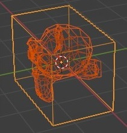
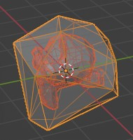
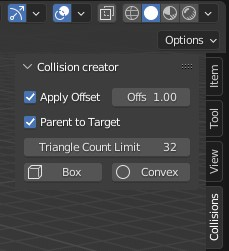

# collision-creator-addon
Quickly create basic UCX collision meshes in Blender.

Select a mesh, tweak settings, and click the box or convex button.

|bounding box | convex mesh| n panel|
|--|--|--|
|  |   |   |

### Features
- apply offset: enable extra offset on collider
- offset: the amount of offset
- parent to target: parent the collider under the source mesh
- tri count limit: only used for convex, limits tri count of the collider

- box: create a bounding box collider
- convex: create a convex mesh collider

Created colliders have name UCX_originalname

### Community
blender artists [thread](https://blenderartists.org/t/free-add-on-easy-collision-creator-for-unreal-ucx-meshes/1466536)
