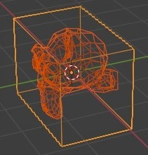
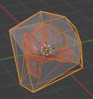
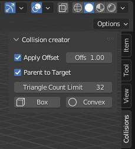

# UCX Collision creator addon
Quickly create basic UCX collision meshes in Blender.

Select a mesh, tweak settings, and click the `Box` or `Convex` button. (don't us `ctrl-Z` afterwards, it crashes Blender)  
This generates a new collision mesh in the same position, named `UCX_originalmeshname`
|bounding box | convex mesh| n panel|
|--|--|--|
|  |   |   |

### Features
- apply offset: enable extra offset on collider
- offset: the amount of offset
- parent to target: parent the collider under the source mesh
- tri count limit: only used for convex, limits tri count of the collider
- box: create a bounding box collider
- convex: create a convex mesh collider

Created colliders have name UCX_originalname

### Installation

### plugget installation
- install the [plugget addon](https://github.com/hannesdelbeke/plugget-blender-addon)
- search for `collision-creator` and click install
- you should now see the N-Panel in your 3d View 
 
### manual installation
- on the [github page](https://github.com/hannesdelbeke/collision-creator-addon), find the green button from in the top right, and click on the white arrow to open a dropdown menu
- click `download ZIP`
- unzip the folder somewhere on your pc.
- copy the `collision_creator` folder to your addons folder, e.g. on Windows `C:\Users\user\AppData\Roaming\Blender Foundation\Blender\3.2\scripts\addons`
- open blender
- in the menu in the top left of the window, click on `Edit/Preferences...` to open the preferences window
- Click on the `add-ons` tabs on the left
- Search for the collision-creator addon and enable it
- you should now see the N-Panel in your 3d View 

### Community
- blender artists [thread](https://blenderartists.org/t/free-add-on-easy-collision-creator-for-unreal-ucx-meshes/1466536)
- a similar, more advanced Blender addon: Unreal collider tool https://github.com/CydoniaValley/ue_collider_tool
- if this tool is helpful, you can ⭐ star it on the [github page](https://github.com/hannesdelbeke/collision-creator-addon) by clicking the `⭐ star` button in the top right of this page. 🙏
